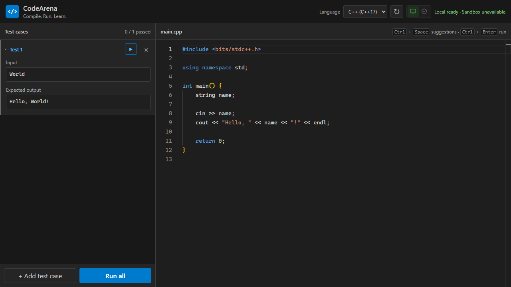
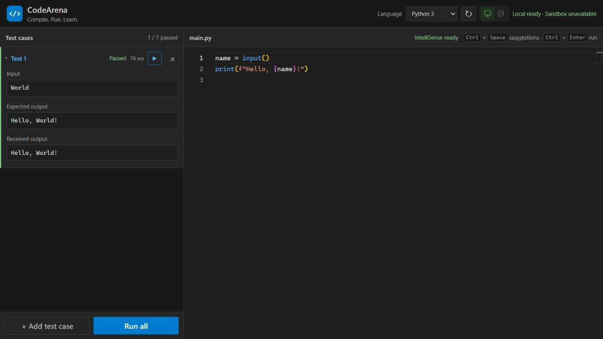

# CodeArena

CodeArena is a browser-based workspace for writing and running C, C++, Java, and Python. It provides a focused editor, code suggestions, saved drafts, and reusable test cases in one interface.



## Features

- Support for C11, C++17, Java, and Python 3.
- Code completion, hints, diagnostics, and common editor shortcuts.
- Separate saved drafts and test cases for each language.
- Individual test execution or a complete test run.
- Clear output, error messages, execution status, and timing.
- <kbd>Ctrl</kbd> + <kbd>Enter</kbd> runs all tests from anywhere on the page.



## Execution environments

The environment control beside Reset for Local and  Sandbox env.

- **Local** runs code through the local compiler on the machine. Before becoming available, app verifies the language availiablity.
- **Sandbox** runs code through a Docker env.

CodeArena by default selects Local until user explicitly selects Sandbox. IntelliSense remains independent of the execution environment.

## Installation

Install the project dependencies once:

```powershell
npm run install:all
```

### Local mode

Start the runner and the website in separate terminals:

```powershell
npm run local
npm run dev:frontend
```

Open <http://localhost:5173>.

### Sandbox mode

Start Docker Desktop, then run:

```powershell
npm start
```

Open <http://localhost:8080>.